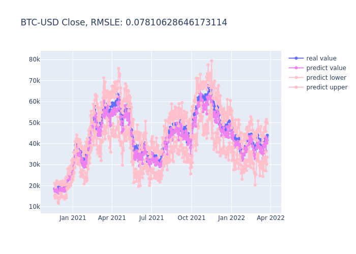

# SCINet
Sample Convolution and Interaction Networks  
papers: https://arxiv.org/pdf/2106.09305v3.pdf

# Requirements
tensorflow=2.6.2  
pandas=1.1.5  
numpy=1.19.5  
scikit-learn=0.24.2  
giotto-tda=0.5.1  
plotly=5.10.0  
importlib=1.0.4  

# Set training
### complie bash_profile, Environmental variable registration required

$ mkdir -p module/ home/  
$ cd module  
$ git pull https://github.com/kck-reseacher/SCINet.git  
$ vi .bash_profile  
export MODULE_HOME=/home/{userid}/home  
export MODULE_PATH=/home/{userid}/module  
$ source .bash_profile  

# How to Training

$ python train.py -d {train data directory} -g {gpu number} -m {module name}
## example
$ python train.py -d /home/kck/home/train_data -g 0 -m analyzer

# How to Predict

$ python predict.py -d {train data directory} -m {module name}
## example
$ python predict.py -d /home/kck/home/train_data -m analyzer

# predict result
## BTC-USD Close feature

